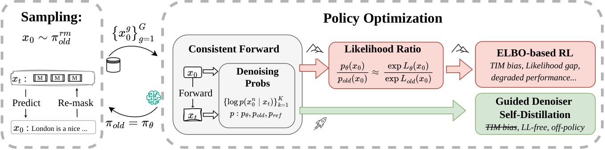
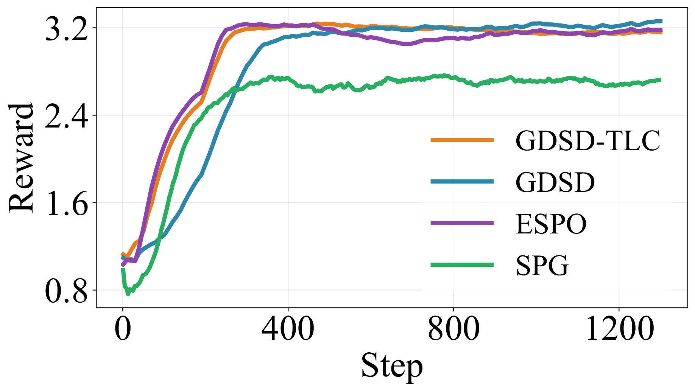
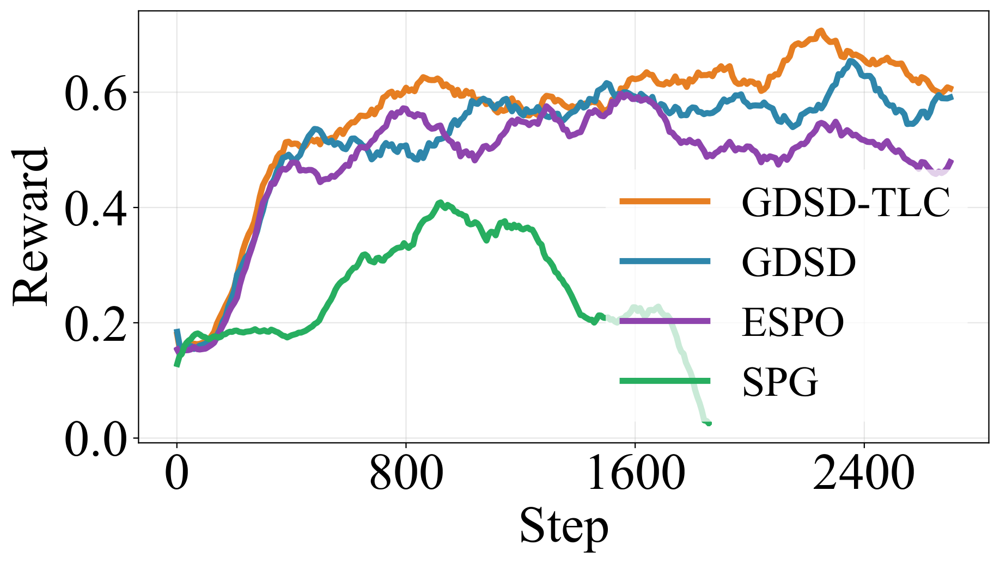
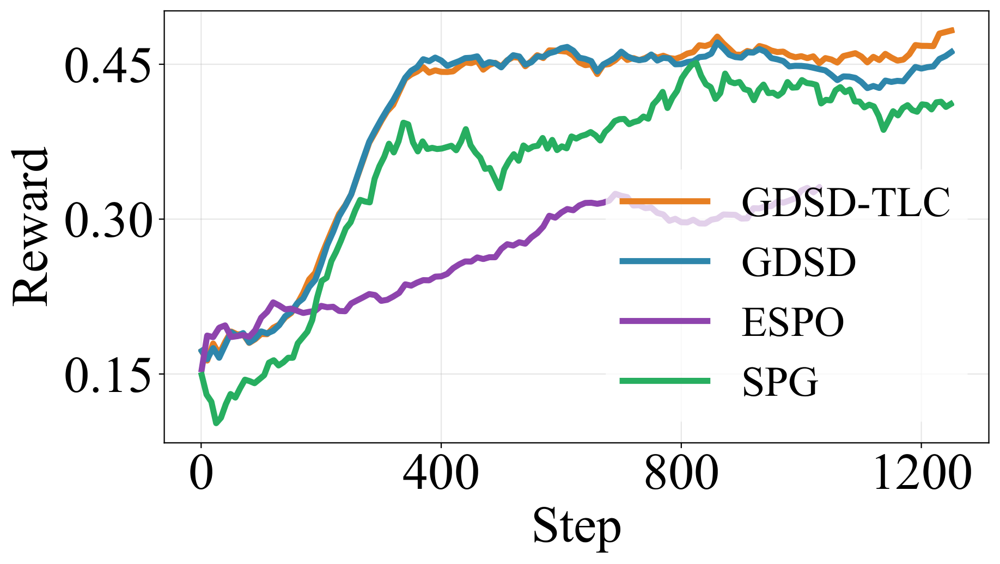
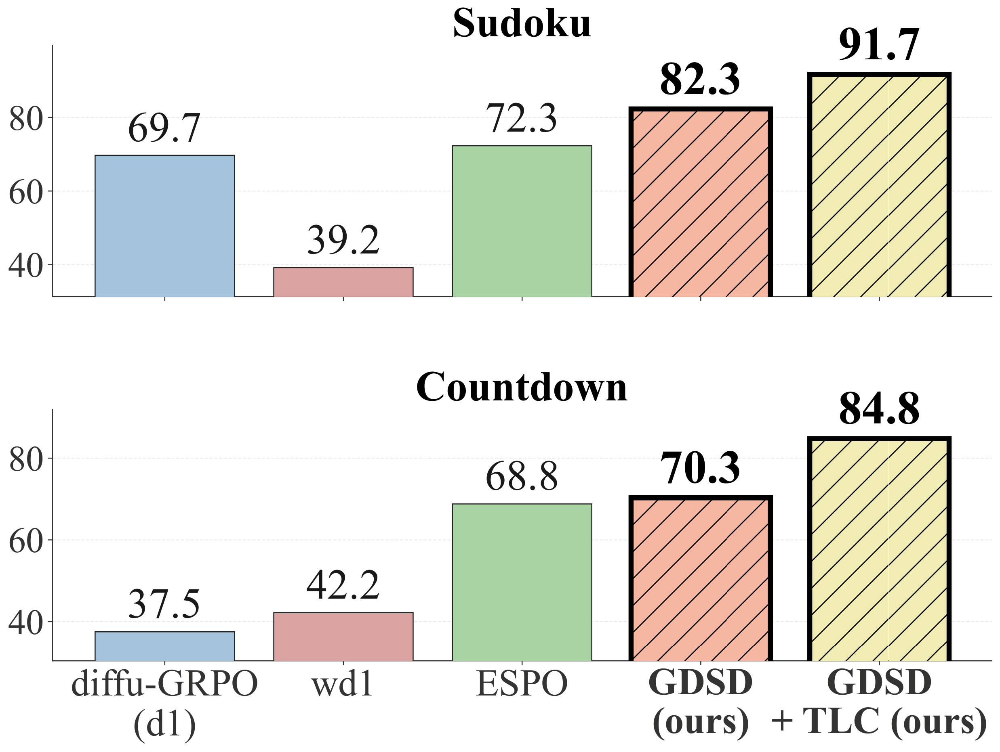
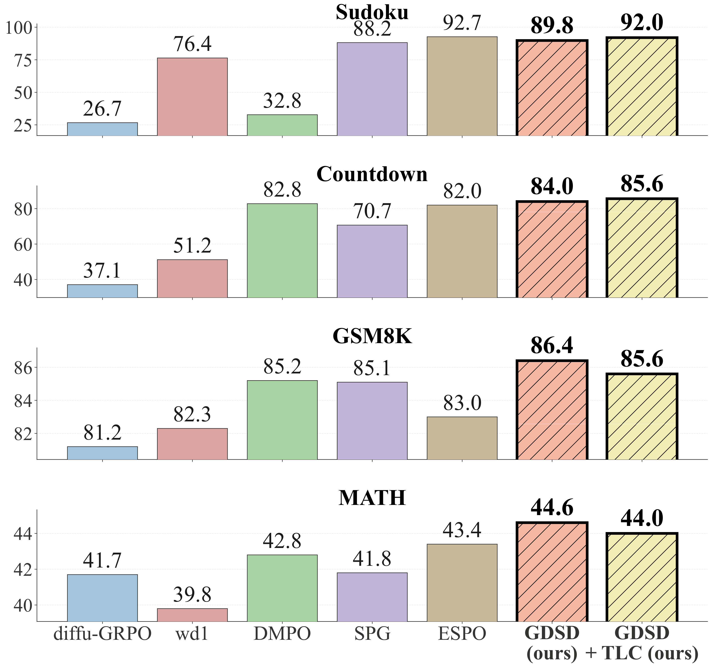

# GDSD: Reinforcement Learning as Guided Denoiser Self-Distillation for Diffusion Language Models

This is the official implementation of [GDSD](https://arxiv.org/abs/2605.29398), a novel post-training method for masked diffusion language models that converts RL into an equivalent self-distillation procedure without any likelihood approximation.

<p align="center">
  
</p>

Unlike previous methods that rely on the ELBO terms $L_\theta(x_0)$ and $L_{\mathrm{old}}(x_0)$ to estimate the likelihood ratio in RL, our method directly matches denoiser logits for denoiser self-distillation, making the procedure likelihood-free and avoiding potential bias.

### Training rewards
GDSD demonstrates more stable training than ELBO-based methods.
<table align="center">
  <tr>
    <td align="center" width="33%"><br><sub>GSM8K</sub></td>
    <td align="center" width="33%"><br><sub>Countdown</sub></td>
    <td align="center" width="33%"><br><sub>Coding</sub></td>
  </tr>
</table>

### Accuracies
GDSD consistently improves performance compared with ELBO-based methods.
<table align="center">
  <tr>
    <td align="center" width="49%"><br><sub>Dream-7B</sub></td>
    <td align="center" width="49%"><br><sub>LLaDA-8B</sub></td>
  </tr>
</table>

The main entry point is `gdsd/gdsd_train.py`; it supports GDSD, GDSD-TLC, ESPO, and SPG through `--rl_loss_type`.

## Layout

```text
gdsd/
  gdsd_train.py                    # training entry point
  configs.py                       # script and trainer arguments
  data_utils.py                    # public/bundled dataset loaders
  rewards.py                       # task reward functions
  trainers/
    gdsd_trainer_batchll.py        # GDSD objective
    gdsd_trainer_tlc.py            # GDSD with token logits centralization
    espo_trainer.py                # ESPO baseline trainer
    spg_trainer.py                 # SPG baseline trainer
  utils/
    model_utils.py                 # model/tokenizer loading
    local_sandbox.py               # local code-task executor
    math500_utils.py               # math answer normalization helpers
scripts/
  train_gdsd.yaml                  # base training config
  run_gdsd_llada_gsm8k.sh          # GSM8K GDSD recipe
  run_gdsd_llada_math.sh           # Math GDSD recipe
  run_espo_llada_math.sh           # Math ESPO recipe
  run_spg_llada_gsm8k.sh           # GSM8K SPG recipe
  run_gdsd_llada_sudoku.sh         # one-GPU smoke/demo recipe
  run_gdsd_tlc_dream_countdown.sh  # one-GPU smoke/demo recipe
eval/
  eval.py                          # Sudoku/Countdown generation runner
  parse_and_get_acc.py             # aggregate accuracy from saved generations
  run_eval.sh                      # minimal evaluation wrapper
math_eval/
  run_eval_gsm8k.sh                # GSM8K/math-style distributed evaluation
  run_eval_all.sh                  # GSM8K/Math wrapper
  llada_eval/lmeval_scripts/       # lm-eval harness wrappers
lm_eval/
  ...                              # bundled lm-evaluation-harness code
dataset/
  4x4_sudoku_unique_puzzles.csv
  4x4_test_sudoku.csv
  countdown_cd3_test.jsonl
```

## Installation

```bash
conda create -n gdsd python=3.10 -y
conda activate gdsd
pip install -r requirements.txt
```

For large GPU runs, install any hardware-specific packages such as FlashAttention
according to the local CUDA/PyTorch environment.

## Training Examples

Run from the root of this archive.

```bash
bash scripts/run_gdsd_llada_sudoku.sh
bash scripts/run_gdsd_tlc_dream_countdown.sh
bash scripts/run_gdsd_llada_gsm8k.sh
bash scripts/run_gdsd_llada_math.sh
bash scripts/run_spg_llada_gsm8k.sh
bash scripts/run_espo_llada_math.sh
```

The scripts use public model identifiers by default. To use a local model copy,
set `MODEL_NAME_OR_PATH`:

```bash
MODEL_NAME_OR_PATH=/path/to/model bash scripts/run_gdsd_llada_sudoku.sh
```

Weights & Biases logging is disabled in `scripts/train_gdsd.yaml` by default.
Enable it locally by changing `report_to` and setting the usual environment
variables outside this archive.

## Evaluation Examples

Run from the `eval/` directory:

```bash
cd eval
DATASET=countdown MODEL_PATH=GSAI-ML/LLaDA-8B-Instruct bash run_eval.sh
```

Set `CHECKPOINT_PATH` to evaluate a trained LoRA checkpoint:

```bash
CHECKPOINT_PATH=../outputs/sudoku_gdsd_demo/checkpoints/checkpoint-500 DATASET=sudoku bash run_eval.sh
```

For GSM8K/Math runs using the bundled lm-eval-compatible path:

```bash
cd math_eval/llada_eval/lmeval_scripts
MODEL_PATH=GSAI-ML/LLaDA-8B-Instruct bash lmeval_batch_gsm8k.sh
MODEL_PATH=GSAI-ML/LLaDA-8B-Instruct bash lmeval_batch_math.sh
```


## Checkpoints

We release our checkpoints for the benefit of the community. 

| Algorithm | Task   | Base model | Link                                                             |
|-----------|--------|------------|------------------------------------------------------------------|
| GDSD-TLC  | Sudoku | Dream-7B   | https://huggingface.co/diffusion-reasoning/gdsd_sudoku_dream     |
| GDSD-TLC  | Countdown | Dream-7B   | https://huggingface.co/diffusion-reasoning/gdsd_countdown_dream     |
| GDSD-TLC  | Sudoku | LLaDA-8B   | https://huggingface.co/diffusion-reasoning/gdsd_sudoku_llada     |
| GDSD-TLC  | Countdown | LLaDA-8B   | https://huggingface.co/diffusion-reasoning/gdsd_countdown_llada     |
| GDSD-TLC  | Code | LLaDA-8B   | https://huggingface.co/diffusion-reasoning/gdsd_code_llada     |

## Acknowledgements.

The code is developed based on [ESPO](https://github.com/ML-GSAI/ESPO) and [SPG](https://github.com/facebookresearch/SPG). We sincerely appreciate their contribution to the community. 

## Citation 

If you find GDSD helpful, please consider citing us:)

```
@misc{tang2026gdsdreinforcementlearningguided,
      title={GDSD: Reinforcement Learning as Guided Denoiser Self-Distillation for Diffusion Language Models}, 
      author={Xiaohang Tang and Keyue Jiang and Che Liu and Qifang Zhao and Xiaoxiao Xu and Sangwoong Yoon and Ilija Bogunovic},
      year={2026},
      eprint={2605.29398},
      archivePrefix={arXiv},
      primaryClass={cs.LG},
      url={https://arxiv.org/abs/2605.29398}, 
}
```


